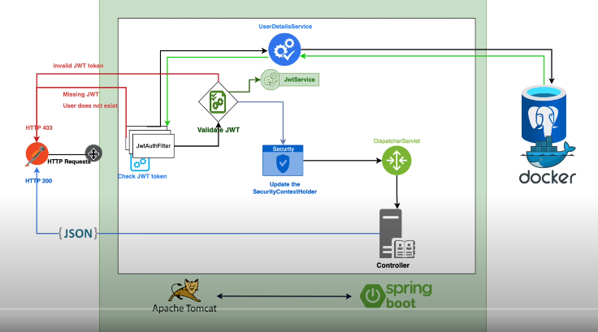

# Spring Security
Spring Security é uma estrutura de autenticação e controle de acesso poderosa e altamente personalizável. É o padrão para proteger aplicativos baseados em Spring.

## JWT
JWT (JSON Web Token) é um padrão da indústria (RFC-7519) que define como transmitir e armazenar objetos JSON de forma compacta e segura entre diferentes aplicações. O JWT pode ser assinado usando um segredo (com o algoritmo HMAC) ou um par de chaves pública / privada usando RSA ou ECDSA.



## UserDetails
A interface UserDetails contém informações sobre o usuário, como nome de usuário, senha, autoridades e detalhes da conta.

O Spring Security possui uma classe User que implementa a interface UserDetails. Como uma alternativa de criar sua propria classe, você pode usar a classe User do Spring Security.

### Interface UserDetails
```java
public interface UserDetails extends Serializable {
    Collection<? extends GrantedAuthority> getAuthorities();
    String getPassword();
    String getUsername();
    boolean isAccountNonExpired();
    boolean isAccountNonLocked();
    boolean isCredentialsNonExpired();
    boolean isEnabled();
}
```    

## Novas informações
Aqui colocarei algumas coisas que eu descobrir enquando fazia o curso

### @Table
A anotação @Table é usada para especificar o nome da tabela a ser criada no banco de dados para persistir a entidade anotada. Se você não especificar o nome da tabela, o nome da tabela será o nome da classe anotada com @Entity.

### @GeneratedValue
A anotação @GeneratedValue é usada para especificar a estratégia de geração de valor da chave primária. A estratégia de geração de valor da chave primária pode ser especificada usando a enumeração GenerationType. A enumeração GenerationType fornece as seguintes estratégias de geração de valor da chave primária:

- AUTO: A estratégia de geração de valor da chave primária será escolhida com base no provedor de persistência padrão.
- IDENTITY: A estratégia de geração de valor da chave primária será delegada para o banco de dados.
- SEQUENCE: A estratégia de geração de valor da chave primária será delegada para o banco de dados e usará a sequência especificada no @SequenceGenerator para gerar o valor da chave primária.
- TABLE: A estratégia de geração de valor da chave primária será delegada para o banco de dados e usará a tabela especificada no @TableGenerator para gerar o valor da chave primária.
- NONE: A estratégia de geração de valor da chave primária será definida para nenhuma.
- UUID: A estratégia de geração de valor da chave primária será definida para UUID.

Se você não especificar a estratégia de geração de valor da chave primária, o Hibernate usará a estratégia de geração de valor da chave primária AUTO.

### Optional
A classe Optional foi adicionada no Java 8 e é usada para representar um valor opcional que pode ser nulo ou não nulo. O objetivo principal dessa classe é evitar NullPointerException em códigos Java. 

A classe Optional fornece muitos métodos úteis para verificar a presença de valor para evitar NullPointerException. 

- Você pode usar o método isPresent () para verificar a presença de valor antes de chamar o método get (). 
- Você pode usar o método orElse () para retornar um valor padrão se o valor não estiver presente. 
- Você pode usar o método orElseGet () para retornar um valor padrão se o valor não estiver presente. 
- Você pode usar o método orElseThrow () para lançar uma exceção se o valor não estiver presente. 
- Você pode usar o método ifPresent () para executar alguma ação se o valor estiver presente. 
- Você pode usar o método filter () para verificar a presença de valor e aplicar alguma condição para o valor. 
- Você pode usar o método map () para verificar a presença de valor e aplicar alguma transformação no valor. 
- Você pode usar o método flatMap () para verificar a presença de valor e aplicar alguma transformação no valor.

### @Enumerated
A anotação @Enumerated é usada para especificar a estratégia de mapeamento de enumeração. A enumeração pode ser mapeada para um dos seguintes tipos de dados:

- String
- Character
- Integer
- EnumType.ORDINAL: A enumeração será mapeada para o valor ordinal da enumeração.